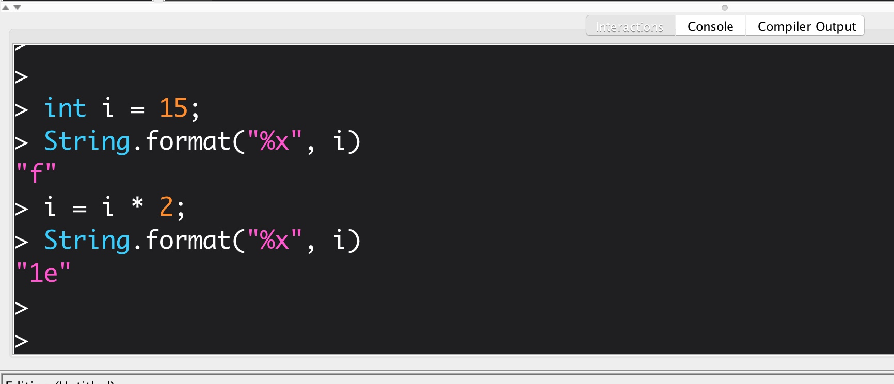

# CSCI 1102 Computer Science 2

### Fall 2018

##### Instructor R. Muller

Boston College

---

## Problem Set 7 : Huffman Coding

### 10 Points

### Due Sunday November 4, 2018 Midnight

This is a two-part pair problem set. Find one partner to work with. If you don't know anyone yet, you can use the partner finding tool on Piazza or you can ask a staffer to help form your team. **Please identify both team members in the comments at the top of your files.**

---

In this and the next problem set you will team up with one other person to design and develop a pair of programs **Huff.java** and **Puff.java** that perform Huffman compression and de-compression (resp.)  of data files. Coding/Decoding algorithms of this kind are sometimes called *codecs*. Huffman coding is a *lossless compression* algorithm that achieves a very respectable rate of compression. In this problem set you are to design and develop the Huff program. After completing the pair of problem sets, your team's pair of programs should have the property that for every text file `f.txt`

```
> cp f.txt original.txt 
> java Huff f.txt            # creates compressed file f.zip
> java Puff f.zip            # creates uncompressed file f.txt
> diff f.txt original.txt
>                            # no message means no differences
```
### Testing Your Huff Program

In addition to a hidden `.gitignore` file, this folder contains:

```
Huff.jar        README.md       samples/
Puff.jar        img/            src/
```

The `src` directory contains a `FileIO` ADT that you can use for reading and writing files. More on that below. The file `Huff.jar` is a Java archive containing a reference implementation of the *compression* half of the codec. The file `Puff.jar` is a Java archive containing a reference implementation of the *decompression* half of the codec. The `samples` directory contains a few test files. You can try out either half of the codec as follows.

```
> cp samples/lincoln.txt .
> java -jar Huff.jar lincoln.txt        # this produces file lincoln.zip
> rm lincoln.txt
> java -jar Puff.jar lincoln.zip        # this produces a new file lincoln.txt
> diff lincoln.txt samples/lincoln.txt
>                                       # no differences :)
```

#### Generalities

This is a somewhat complicated program with two major parts (i.e., Huff and Puff). You should think carefully about the overall design of the program with an eye toward figuring out what ADTs might be useful and which what pieces of the  implementation might be shared between the Huff and Puff programs. Obviously, the shared parts should be encapsulated in separate files, hopefully ADTs, with appropriate functions and documentation.

You're going to make mistakes. In order to figure out what is wrong it will be important to be able to print out string representations of the various items in play. For this reason, it's essential that each ADT that you create have a reasonable `toString` function.

#### Working with Binary Files

The Huff and Puff programs write and read binary files. So it will be helpful to have a tool that lets you view the contents of binary files. If you are using a unix-based system such as MacOS you may be able to use the built-in **emacs** editor from the command line, as in:

```
> emacs file.zip
```

The emacs editor is very powerful but super-arcane.  You can put emacs into "hexadecimal mode" by typing `esc x` and then `hexl-mode`.  Note that `esc` refers to the key labeled "esc", upper left on your keyboard.  You can then move around the file using the arrow keys. You can exit emacs by typing `control-x control-c` (i.e., holding down the key labeled `control` and then hitting `x` and then `c` while still holding down the `control` key.) And if something goes wrong you can cancel things in emacs by typing `control-g`.

If you're using Windows (or if emacs isn't on your system or doesn't excite you) you can always troll around on the web for free hex-editors. I found <a href="http://download.cnet.com/HxD-Hex-Editor/3000-2352_4-10891068.html">HxD</a> for Windows and <a href="http://www.macupdate.com/app/mac/6455/hexeditor">HexEditor</a> for MacOS. I tried the latter and it worked well enough. I didn't try the former but the reviews seemed OK.

### Ingredients

#### Input/Output

You'll find a `FileIO` ADT in the `src` directory. There are four routines there to support the IO required of both your programs. 

```java
public interface FileIO {

  // opeInputFile opens myFile.txt for reading. See the JRE documentation
  // for FileReader.  This function might be called from Huff.java.
  //
  FileReader openInputFile(String fname);

  // openOutputFile opens a file for output text. This function might be
  // called from Puff.java to create the uncompressed version of the file.
  //
  FileWriter openOutputFile();

  // openBinaryOutputFile is synched up with openInputFile. If openInputFile
  // opened myFile.txt, openOutputFile will create a new binary output file
  // myFile.zip.  See the documentation of BinaryOut in SW.  This function
  // would be called from Huff.java.
  //
  BinaryOut openBinaryOutputFile();

  // openBinaryInputFile can open the zip file to uncompress it. This would
  // be called from Puff.java.
  //
  BinaryIn openBinaryInputFile(String fname);
}
```

#### Working with Bits and Variable Length Patterns of Bits

Huffman coding represents text using variable length bit strings. Short bit strings can be represented in high-level programming languages like Java by using values of type `int`. Ints in Java are 32 bits long. Dr. Java's *Interactions* window is an excellent tool for experimenting with binary representations. Note the use of the `String.format` function together with the hexadecimal field specifier `%x`.



We can turn bits on and move them around using bit-wise or and multiplication (or division) by 2.

#### An ADT for Variable Length Strings of Bits

Huffman codes are *variable length* codes. For example, the letter `'A'` may be represented by the 3-bit string `101` while the letter `'B'` may be represented by the 2-bit string `11`. So in order to represent a variable length bit string in Java it will be convenient to pair the int described above with a second integer specifying the length of the string of bits.

Of course, when we have two values that are related in this way, it usually makes sense to think about encapsulating them in an ADT with appropriate operations. As you know, in Java, an ADT can be specified by an interface and implemented by a class.

#### Symbol Tables --- Representing Information about Input Symbols

Both the Huff and Puff programs will require a table data structure that allows them to look up information about symbols (i.e., characters) that occur in the input text. Tables that associate symbols with information are usually called *symbol tables*. This is the subject of section 3.1 of our textbook.  For the purposes of this project, the symbols are characters. As you know, characters are represented by small integers, usually 8 or 16 bits. For example, the ASCII-assigned integer representation of the letter 'A' is 65. This is a base 10 numeral, it is more common to use its hexadecimal equivalent 0x41. (Note that 0x41 = 4 x 16^1 + 1 x 16^0 = 4 x 16 + 1 x 1 = 64 + 1 = 65.)  In order to print the character associated with one of these numbers, the number would need to be associated with the **char** type.  For most purposes in this application though, you will find it more convenient to work with the characters in the source file as **int**s or even wrapped as **Integer**s.

There are many ways to implement symbol tables in Java. For the purposes of this problem set, you'll want to look at the `java.util.Map<K, V>` interface. You can use any implementing class that you would like but I recommend using the `java.util.HashMap<K, V>` implementation.

What information will you need to store in the symbol table? Two different pieces of information about each input symbol will be required in the Huff program. First, an integer **frequency** will need to be computed that represents the number of occurrences of the given symbol in the input text. The second piece of information required for each symbol is the **binary bit pattern** assigned to the symbol by the algorithm. This latter piece will ultimately be written to the output file.

The frequency information is easily computed from the input file simply by reading the characters in the file and counting their occurrences. The frequency information will be needed in order to construct the Huffman coding tree as described below.

The binary bit pattern can be represented as an object encapsulating the pair of ints as described above. Since we now have another pair of related values (symbol frequency and bit string), it again makes sense to think of encapsulating these two items in an ADT of some kind.

#### Huffman Trees

Another important ingredient for the program is the Huffman coding tree.  A Huffman tree is a simple binary tree data structure in which each node has an integer weight. Huffman trees are `Comparable`: one tree is compared against another by comparing their weights.

What other fields are required? Leaf nodes require an additional integer symbol field while interior nodes (i.e., non-leaf nodes) require two Huffman trees left and right. In order to simplify the trees it's probably best to just have one tree node type with all 4 fields. When processing leaf nodes the symbol and weight fields would be used and the left and right fields would be ignored. For interior nodes weight, left and right fields would be used and the symbol field would be ignored.

I would like to stress the importance of having a reasonable `toString` function for Huffman trees. It will be essential for debugging.

As we have discussed, the Huffman coding tree can be constructed from the information in the symbol table using a priority queue. See the description of the algorithm below.

#### Priority Queues

See the [Java JRE documentation](http://docs.oracle.com/javase/7/docs/api/index.html?overview-summary.html) of the `java.util.PriorityQueue<E>` class.

#### Protocols

In order to ensure that we are all working on the same problem, your program is required to conform to the following protocols:

1. When a Huffman tree with weight *w* is inserted into the priority queue, if there are already trees in the queue with the same weight, the one being inserted should be put BEHIND all others of the same weight;

2. When bit patterns are being assigned to characters, the bit strings are built-up by adding bits to the RIGHT (rather than the left) and a leftward branch in the tree is assigned a 0 bit and a rightward branch is assigned a 1 bit;

3. The compressed file that your Huff program creates should have the following structure.

+ The first 2 bytes should contain the hexadecimal value 0x0BC0. This code identifies your zip file as one that has been compressed by our algorithm.
+ The next 4 bytes contain the integer size of the frequency table. For the purposes of this discussion, call the integer N.
+ The next N x 5 bytes contains the frequency table. Each entry in the table is a pair of values: a one byte character code followed by a 4 byte integer giving its frequency in the input file.
+ The next information in the file is the bit string encoding the input file.

---

## Huff : the Huffman Coding Algorithm

1. Create a new (empty) symbol table.
2. Open the input text file. For each unique character (or symbol) in the input file, create an entry in the symbol table for that symbol. Use the symbol table entry to count the frequency of the character in the input file.  Close the input file when done.
3.  Create a new priority queue for Huffman trees. Recall that the compareTo function for Huffman trees compares trees by their weights. For each key (i.e., symbol) K in the symbol table, look up it's frequency f and create a Huffman tree leaf node with weight f. Insert the leaf node into the priority queue.
4. While the priority queue has more than one element, remove two trees **t1** and **t2** from the priority queue. Construct a new tree **t** with **t1** and **t2** as left and right children (resp.) and with weight = t1.weight() + t2.weight(). Insert the new tree **t** into the priority queue.
5. The priority queue now contains exactly one element: the Huffman coding tree for the input text. Remove the tree from the priority queue. Recursively walk the coding tree recording the binary bit path P at each step. When the recursive walk arrives at a leaf with symbol A, update A's binary bit pattern entry in the symbol table to record the binary path that led from the root to leaf A.
6. The symbol table now has the information required to write the variable length codes to the binary output file.
7. Open the binary output file.
8. Write the signature bits to identify the file as a zip file.
9. Write out the 32-bit length of the symbol table.
10. Next write out the symbol frequency information. For each key in the symbol table, write the key (i.e., the character) using one byte and write its integer frequency using 4 bytes.
11. Reopen the input file.
12. For each occurrence of a character in the input file, look up it's binary bit pattern in the symbol table and write it to the output file.
13. Close the output file.

You're done! Give your code a once over to make sure that it looks great, then push it to the GitHub master repo.